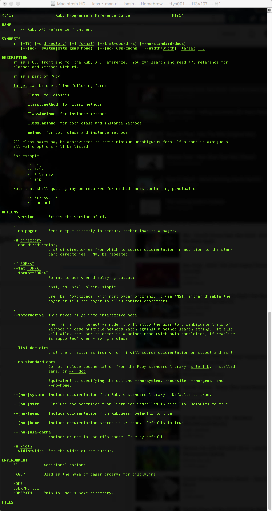
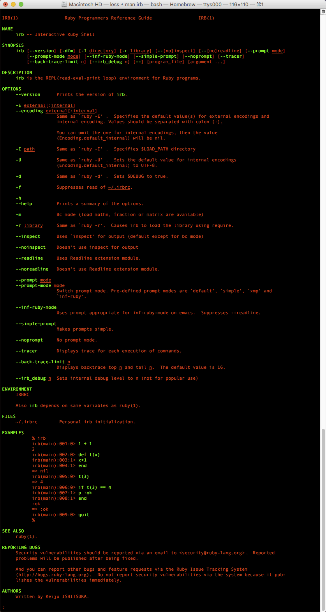

#Eclipse cheat sheets (XML) to DITA with Ruby, XSL, Nokogiri

This project uses [Ruby](https://www.ruby-lang.org/en/) and tries to be and easy to use tutorial on all thing [Ruby](http://ruby-doc.org).

Ruby dates back to the 1990's and was first created by a Japanese man named [Yukihiro "Matz" Matsumoto](https://en.wikipedia.org/wiki/Yukihiro_Matsumoto). 

Hey come and check out the [Ruby in 4 seconds](https://youtu.be/ayx4fASYkZU) video.

I worked on the open source [Java](https://www.oracle.com/java/index.html) based project [Debrief](http://debrief.info/) the leading maritime analysis tool which is also on GitHub at [https://github.com/debrief/debrief](https://github.com/debrief/debrief).  

The Debrief project used [Apache Ant](http://ant.apache.org), [SaxonHE](https://sourceforge.net/projects/saxon/files/Saxon-HE/), [XSLT 2.0](https://www.w3.org/TR/xslt20/) and [XPath](https://www.w3.org/TR/xpath-3/) and ran inside [Eclipse](https://eclipse.org) therefore requiring [Java](http://www.oracle.com/technetwork/java/javase/downloads/index.html).  The Debrief document publishing project has been extracted into its own self contained GitHub repository at [https://github.com/jbampton/eclipse-cheatsheets-to-dita-to-pdf](https://github.com/jbampton/eclipse-cheatsheets-to-dita-to-pdf).

Using [Ruby](http://www.iso.org/iso/iso_catalogue/catalogue_tc/catalogue_detail.htm?csnumber=59579) on this project allows use to harness the power of [RubyGems](https://rubygems.org/) particularly the [Nokogiri](http://www.nokogiri.org/) gem along with XSLT 1.0 / XPath 1.0 to create the DITA XML files.  Using Ruby eliminates the need to use Eclipse and Apache Ant and can be run standalone from the command line as long as you have Ruby installed.

[Darwin Information Typing Architecture](https://en.wikipedia.org/wiki/Darwin_Information_Typing_Architecture) (DITA) is an [XML](https://en.wikipedia.org/wiki/XML) data model for authoring and using the [DITA Open Toolkit](http://www.dita-ot.org/) (DITA-OT) you can publish those ideas.

The DITA standard is maintained by the [OASIS](https://www.oasis-open.org/) DITA Technical Committee.

[Ruby](https://www.ruby-lang.org/en/) is very [powerful](https://www.ruby-lang.org/en/documentation/success-stories/) and this project's Ruby code has some [XSL](https://en.wikipedia.org/wiki/XSL) code embedded,
 as well as some [XML](https://en.wikipedia.org/wiki/XML) markup in an interpolated [Heredoc](http://ruby-doc.org/core-2.2.0/doc/syntax/literals_rdoc.html) syntax. 

The [Eclipse cheat sheets](http://help.eclipse.org/mars/index.jsp?topic=%2Forg.eclipse.platform.doc.user%2Freference%2Fref-cheatsheets.htm) test data folder - 'cheatsheets-xml-test-data' is best viewed inside Eclipse, and are used as input when 'default.rb' runs.

There are two types of Ruby files: .rb, .rbw

The Ruby file that is used in this project is 'default.rb' builds the output parent Ditamap 'map.ditamap' (output/map.ditamap) and the 4 sub dita tasks in the 'output/dita' folder.

As we are using Ruby you will need to see if it's installed on your system.

[Matz](https://en.wikipedia.org/wiki/Yukihiro_Matsumoto) made run Ruby fun and easy to learn, so don't be sacred and first check out a short Ruby YouTube video I created.

[Ruby in 29 seconds](https://youtu.be/2ei7S0FU65E)

If you are still to afraid to dive in and try Ruby, how about a couple easy free web based interactive courses on Ruby:

- [Try Ruby](http://tryruby.org/levels/1/challenges/0) 
- [Codecademy Ruby](https://www.codecademy.com/learn/ruby)

And then come train in the [REAL DOJO](http://www.codewars.com) and reach your highest potential, become faster, stronger and more powerful....JEDI MASTER LEVEL.....1??!?!!  

So now that you are Ruby Gung-Ho, the new Ruby [Bruce Lee](https://en.wikipedia.org/wiki/Bruce_Lee) on the street, open a terminal and type:

###ruby -v  

For further information on your local Ruby environment type: 

###ruby --help

If you would like to read more in-depth about Ruby type:

###man ruby

You can use the up and down arrows to navigate through the man page.  Press q to quit

Ruby also ships with 'ri' a tool used to display information about Ruby Classes, modules and methods from your terminal

A lot of people don't know 'ri' exists and use google search instead.

###man ri

Ruby also ships with a fantastic tool called IRB.  IRB is the interactive Ruby console where you can test out your Ruby commands inside a terminal.  

###man irb

And to use IRB type:

###irb

You type 'exit' to stop using irb and return to the standard terminal.

Man pages hold a lot of information about programs and should be your first point of call when trying to understand a program like Ruby

This program uses the Nokogiri gem so you must install it by running:
 
###gem install nokogiri

For more information on the gem command:

###gem -h 

I recommend running: 

###gem list --local  

that shows which gems are currently installed on your system.  

To see in further detail which gems are installed bring up a locally served web page at http://localhost:8808/ by typing: 

###gem server

I used RubyMine and OS X for development.  RubyMine is an integrated development environment (IDE) for Ruby and Rails projects and has Git functionality built in.

RubyMine is a very advanced code editor that is a commercial product from JetBrains.  I also like PyCharm and IntelliJ from JetBrains.

Eclipse is a more general purpose IDE written mainly in Java.

##Resources

Nokogiri - http://www.nokogiri.org/

JetBrains RubyMine - https://www.jetbrains.com/ruby/

Eclipse - https://eclipse.org/

Eclipse cheat sheets - http://help.eclipse.org/mars/index.jsp?topic=%2Forg.eclipse.platform.doc.user%2Freference%2Fref-cheatsheets.htm

DITA - https://en.wikipedia.org/wiki/Darwin_Information_Typing_Architecture

XSLT FAQ. Docbook FAQ. Braille. - http://www.dpawson.co.uk/

W3C - The Extensible Stylesheet Language Family (XSL) - http://www.w3.org/Style/XSL/

The Organization for the Advancement of Structured Information Standards (OASIS) - https://en.wikipedia.org/wiki/OASIS_(organization)

Codecademy - Learn the Command Line - https://www.codecademy.com/courses/learn-the-command-line

Codecademy - Learn Ruby - https://www.codecademy.com/learn/ruby

CodeSchool - Got 15 minutes and want to learn Git? https://try.github.io/levels/1/challenges/1

CodeSchool Try Ruby - https://www.codeschool.com/courses/try-ruby

Ruby regular expression editor - http://rubular.com/

JetBrains Intellij - https://www.jetbrains.com/idea/

JetBrains PyCharm - https://www.jetbrains.com/pycharm/

Essential programmer training - http://www.codewars.com/

Help and documentation for the Ruby programming language - http://ruby-doc.org/

Ruby Programming Language - https://www.ruby-lang.org/en/

The Ruby Toolbox - https://www.ruby-toolbox.com/

Homebrew - The missing package manager for OS X - http://brew.sh/

Install Homebrew formulas - http://brewformulas.org/

Oracle Virtualbox - https://www.virtualbox.org/

RubyInstaller for Windows - http://rubyinstaller.org/

Ruby Version Manager (RVM) - https://rvm.io/

Installing Ruby - https://www.ruby-lang.org/en/documentation/installation/ 

Ruby success stories - https://www.ruby-lang.org/en/documentation/success-stories/

Ruby Motion success stories - http://www.rubymotion.com/references/success-stories/

The Top Ruby Jobs - https://toprubyjobs.com/

Australian companies using Rails - https://github.com/rails-oceania/roro/wiki/Australian-Companies-using-Ruby-on-Rails

IDE - Integrated Development Environment - https://en.wikipedia.org/wiki/Integrated_development_environment

Git (software) - https://en.wikipedia.org/wiki/Git_(software)

man page - https://en.wikipedia.org/wiki/Man_page

Terminal (OS X) - https://en.wikipedia.org/wiki/Terminal_(OS_X)

Essential programmer training - http://www.codewars.com/

Mastering Markdown - https://guides.github.com/features/mastering-markdown/